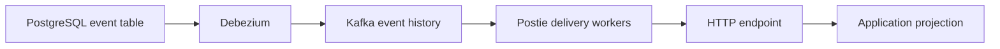

<h1 align="center">Postie</h1>

Postie captures committed rows from append-only PostgreSQL event tables,
retains them in Kafka, and delivers them to HTTP endpoints. It handles capture,
routing, retries, acknowledgements, and delivery state. Your application owns
event schemas, business rules, and projections.



Replay jobs and administrative repair of blocked streams are not implemented.

## Getting started

You need Go 1.26 or later and Docker with Compose. Run every command from the
repository root. The Compose stack uses roughly 700 MB of memory.

Copy the sample environment file and load it into your shell:

```bash
cp .env.example .env
set -a
. ./.env
set +a
```

Validate the example configuration. This does not connect to PostgreSQL,
Kafka, or an HTTP destination:

```bash
go run ./cmd/postiectl config validate --config examples/postie.yaml
```

The sample reports one PostgreSQL source and one HTTP destination. Engine
settings are in [examples/postie.yaml](examples/postie.yaml). Application
sources and destinations are in
[examples/application.yaml](examples/application.yaml). Both files support
`${NAME}` substitution in string and duration values. Numeric fields need
literal numbers, and a missing variable fails validation.

Start the local PostgreSQL, control PostgreSQL, Kafka, Kafka Connect, and
Postie services:

```bash
docker compose --profile postie up --build -d
```

The `postie` profile is required to start the HTTP API and delivery workers.

| Service          | Address           |
| ---------------- | ----------------- |
| Source database  | `localhost:15432` |
| Control database | `localhost:15433` |
| Kafka            | `localhost:29092` |
| Kafka Connect    | `localhost:18083` |

The source database uses `postie` as its user, password, and database name.

**The bundled source database does not create the application database, event
table, capture user, or HTTP receiver that the sample configuration uses.**
Point `examples/application.yaml` at an existing append-only table and receiver
before provisioning. If you use the local source database, create those
resources there first.

Provision the first stream generation from inside the Compose network:

```bash
docker compose run --rm --entrypoint postiectl postie \
  provision --config /app/examples/postie.yaml --generation 1
```

Provisioning validates each source table, creates or verifies its Kafka topic,
configures the Debezium connector, and stores the stream identity. It does not
start HTTP delivery. The Postie service consumes generation 1 by default.

Provision the same generation again and it verifies the stored identity, topic,
connector, and replication slot. A missing or changed history boundary blocks
the stream for diagnosis.

Check liveness and readiness:

```bash
curl -fsS http://localhost:8081/health/live
curl -i http://localhost:8081/health/ready
```

Readiness stays at HTTP 503 until capture, Kafka, control state, and workers
are available. Check status with the operator token:

```bash
curl -fsS \
  -H "Authorization: Bearer $POSTIE_OPERATOR_TOKEN" \
  http://localhost:8081/v1/status
```

The operator API also lists subscriptions, pauses or resumes a destination, and
reads recent activity. The routes are in
[Delivery and operations](docs/specification.md#delivery-and-operations).

## Delivery contract

Postie sends a Basic-authenticated JSON `POST` with source and destination
identifiers, descriptions, and a JSON payload. What happens next depends on
your response:

| Response                                                                                          | What Postie does                                                |
| ------------------------------------------------------------------------------------------------- | --------------------------------------------------------------- |
| A 2xx containing `{"result":{"success":{}}}`                                                      | Accepts the acknowledgement. Nothing else counts as success.    |
| A `keep_going` error                                                                              | Records a terminal skip.                                        |
| `must_retry`, a malformed acknowledgement, a non-2xx response, a timeout, or a connection failure | Retries with jittered exponential backoff from 1 to 60 seconds. |

Redirects are not followed, and responses above 64 KiB are rejected.

**Delivery is at least once.** A crash after the HTTP acknowledgement but
before the Kafka commit can produce a duplicate. Your receiver should apply an
event and save its idempotency key in the same transaction. Each partition
delivers in order, and a retrying partition does not block other partitions.

See [the protocol contract](docs/protocol.md) for wire fields, acknowledgements,
filters, and supported PostgreSQL values.

## Documentation

| Document                               | Purpose                                                                       |
| -------------------------------------- | ----------------------------------------------------------------------------- |
| [Architecture](docs/architecture.md)   | Package boundaries and runtime ownership.                                     |
| [Protocol](docs/protocol.md)           | JSON, authentication, acknowledgements, filters, and source value conversion. |
| [Specification](docs/specification.md) | Supported capture and delivery behavior.                                      |
| [Quality procedures](docs/qa.md)       | Checks and local release steps.                                               |

## Development

Run the offline checks:

```bash
make lint test
```

Use the focused suites when you change a specific contract:

| Change area                        | Checks               |
| ---------------------------------- | -------------------- |
| Protocol formatting or filtering   | `make contract fuzz` |
| User-visible behavior              | `make bdd`           |
| A fixed regression                 | `make regression`    |
| Package boundaries                 | `make architecture`  |
| Capture, workers, or control state | `make integration`   |

The integration suite uses its own `postie-integration` Compose project and
ports 25432, 25433, 39092, and 28083. It can run beside the development stack,
but run only one integration suite at a time. Set `POSTIE_KEEP=1` to keep the
integration containers and volumes for inspection.

The main code areas are `internal/config`, `internal/protocol`,
`internal/delivery`, `internal/adapters/debezium`, `internal/provision`,
`internal/control`, and `internal/adapters/operator`. The two binaries are
`postie` and `postiectl`, built from `cmd/postie` and `cmd/postiectl`.
