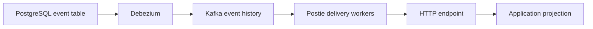

<h1 align="center">Postie</h1>

Postie captures committed rows from append-only PostgreSQL event tables,
retains them in Kafka, and delivers them to HTTP endpoints. It handles capture,
routing, retries, acknowledgements, and delivery state. Your application owns
event schemas, business rules, and projections.



Replay jobs and administrative repair of blocked streams are not implemented.

## Run locally

You need Go 1.26 or later and Docker with Compose. Run these commands from the
repository root. The Compose stack uses roughly 700 MB of memory.

Copy the sample environment file and export its values for local commands:

```bash
cp .env.example .env
set -a
. ./.env
set +a
```

Validate the example configuration without connecting to PostgreSQL, Kafka, or
an HTTP destination:

```bash
go run ./cmd/postiectl config validate --config examples/postie.yaml
```

The sample reports one PostgreSQL source and one HTTP destination. The engine
settings are in [examples/postie.yaml](examples/postie.yaml); application
sources and destinations are in
[examples/application.yaml](examples/application.yaml). Both files support
`${NAME}` substitution in string and duration values. Numeric fields require
literal numbers, and a missing variable fails validation.

Start the local PostgreSQL, control PostgreSQL, Kafka, Kafka Connect, and
Postie services:

```bash
docker compose --profile postie up --build -d
```

The `postie` profile is required to start the HTTP API and delivery workers.
The local source database is available at `localhost:15432`, the control
database at `localhost:15433`, Kafka at `localhost:29092`, and Kafka Connect at
`localhost:18083`. The source database uses the `postie` user, password, and
database name.

The bundled source database does not create the application database, event
table, capture user, or HTTP receiver used by the sample configuration. Point
`examples/application.yaml` at an existing append-only table and receiver
before provisioning. When using the local source database, create those
application resources there first.

Provision the first stream generation from inside the Compose network:

```bash
docker compose run --rm --entrypoint postiectl postie \
  provision --config /app/examples/postie.yaml --generation 1
```

Provisioning validates each source table, creates or verifies its Kafka topic,
configures the Debezium connector, and stores the stream identity. It does not
start HTTP delivery; the Postie service consumes generation 1 by default.
Provisioning the same generation again verifies the stored identity, topic,
connector, and replication slot. A missing or changed history boundary blocks
the stream for diagnosis.

Check liveness and readiness:

```bash
curl -fsS http://localhost:8081/health/live
curl -i http://localhost:8081/health/ready
```

Readiness remains HTTP 503 until capture, Kafka, control state, and workers are
available. Check status with the operator token:

```bash
curl -fsS \
  -H "Authorization: Bearer $POSTIE_OPERATOR_TOKEN" \
  http://localhost:8081/v1/status
```

The operator API also lists subscriptions, pauses or resumes a destination, and
reads recent activity. See [Delivery and operations](docs/specification.md#delivery-and-operations)
for the routes.

## Delivery contract

Postie sends a Basic-authenticated JSON `POST` with source and destination
identifiers, descriptions, and a JSON payload. It accepts a successful
acknowledgement only when the response is a 2xx containing
`{"result":{"success":{}}}`. A `keep_going` error is recorded as a terminal
skip; `must_retry`, malformed acknowledgements, non-2xx responses, timeouts, and
connection failures retry with jittered exponential backoff from 1 to 60
seconds. Redirects are not followed, and responses above 64 KiB are rejected.

Delivery is at least once. A receiver should apply an event and save its
idempotency key in the same transaction because a crash after the HTTP
acknowledgement but before the Kafka commit can produce a duplicate. Each
partition delivers in order; a retrying partition does not block other
partitions.

See [the protocol contract](docs/protocol.md) for wire fields, acknowledgements,
filters, and supported PostgreSQL values.

## Development

Run the offline checks with:

```bash
make lint test
```

Use the focused suites when changing a specific contract:

| Change area                        | Checks               |
| ---------------------------------- | -------------------- |
| Protocol formatting or filtering   | `make contract fuzz` |
| User-visible behavior              | `make bdd`           |
| A fixed regression                 | `make regression`    |
| Package boundaries                 | `make architecture`  |
| Capture, workers, or control state | `make integration`   |

The integration suite uses its own `postie-integration` Compose project and
ports 25432, 25433, 39092, and 28083. It can run beside the development stack;
run one integration suite at a time. Set `POSTIE_KEEP=1` to leave the
integration containers and volumes for inspection.

The main code areas are `internal/config`, `internal/protocol`,
`internal/delivery`, `internal/adapters/debezium`, `internal/provision`,
`internal/control`, and `internal/adapters/operator`. The two binaries are
`postie` and `postiectl`, built from `cmd/postie` and
`cmd/postiectl`.

## Documentation

- [Architecture](docs/architecture.md) describes package boundaries and runtime ownership.
- [Protocol](docs/protocol.md) defines JSON, authentication, acknowledgements, filters, and source value conversion.
- [Specification](docs/specification.md) describes supported capture and delivery behavior.
- [Quality procedures](docs/qa.md) lists checks and local release steps.
