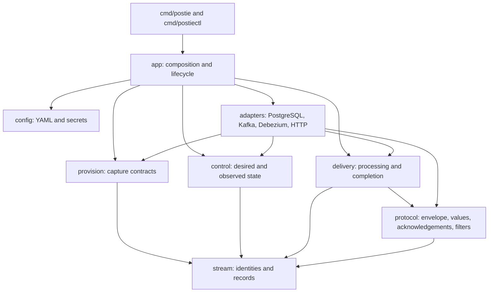

# Postie architecture

The `postie` service and `postiectl` command share the composition layer.
All application packages are internal to the module
`github.com/rafaeelricco/postie`.



## Package boundaries

| Package              | Responsibility                                                                                  |
| -------------------- | ----------------------------------------------------------------------------------------------- |
| `internal/app`       | Builds adapters, maps configuration, starts workers and the operator API, and closes resources. |
| `internal/config`    | Loads and validates YAML, applies defaults and environment substitution, and handles secrets.   |
| `internal/stream`    | Defines sources, generations, immutable stream identities, capture names, and decoded records.  |
| `internal/provision` | Validates source table contracts and provisions topics, connectors, slots, and publications.    |
| `internal/control`   | Tracks desired subscriptions, worker observations, leases, readiness, and blocked streams.      |
| `internal/delivery`  | Applies filters, retries, acknowledgements, durable skips, and ordered commits.                 |
| `internal/protocol`  | Formats the HTTP envelope and converts PostgreSQL values; decodes acknowledgements and filters. |
| `internal/adapters`  | Implements PostgreSQL, Kafka, Debezium Connect, HTTP delivery, and the operator API.            |
| `internal/activity`  | Provides bounded structured activity and cursor-based reads.                                    |

Core packages depend on interfaces rather than database, broker, or HTTP
clients. The architecture check in `make architecture` guards those dependency
boundaries.

## Runtime ownership

1. `app.Bootstrap` constructs Kafka administration, control storage, PostgreSQL
   catalog clients, and the Kafka Connect client. The `postiectl provision`
   command validates a stream and records its identity; it does not start
   delivery workers.
2. `app.New` builds the control service and consumer factory. The control
   service renews a 30-second worker lease every five seconds, checks capture
   and dependencies, and reconciles desired destination state.
3. The Kafka adapter owns group membership, partition assignment, bounded
   batches, fetch backpressure, retained-history checks, and ownership-guarded
   commits. It preserves the source topic, partition, offset, and leader epoch
   when creating a stream record.
4. A delivery worker processes each partition sequentially. It decodes the
   record, checks for an existing durable skip, and formats the request. It
   then retries until a terminal outcome, persists a terminal skip when needed,
   and commits the offset. A crash after acknowledgement and before commit can
   redeliver the event, so receivers must deduplicate.
5. HTTP requests are fenced by the current dispatch lease. Revocation cancels
   in-flight requests and prevents late commits. One blocked partition does not
   stop delivery on other partitions.
6. Pause and resume persist desired state and wait for live workers to observe
   the revision. A loss of readiness stops dispatch. Shutdown stops workers
   before releasing the lease and closing adapters.

## Persistence and resource names

The control database creates its state tables with idempotent DDL when opened.
The tables use the `postie_` prefix. Kafka remains authoritative for delivery
offsets. Control PostgreSQL stores stream identities, topic identifiers,
subscription revisions, worker observations, leases, and terminal skips.

Capture topic, connector, slot, and publication names use the `postie_`
prefix and include the generation plus a hash of the namespace, environment,
source ID, and generation. The hash keeps distinct stream identities from
colliding. Connector configuration uses the configured partitioning column
as the Kafka message key and takes an ascending snapshot before following WAL.

## Tests and repository paths

Unit and fuzz tests live beside their implementation. Behavior scenarios are
under `tests/bdd`. `tests/contract` covers the HTTP envelope and delivery path,
`tests/regression` pins acknowledgement behavior and fixed regressions, and
`tests/architecture` checks dependency rules. Integration tests use real
PostgreSQL, Kafka, and Debezium through `tests/integration/compose.yaml` with the
`postie-integration` project on ports 25432, 25433, 39092, and 28083.

Reviewed synthetic protocol examples live in `tests/fixtures/protocol`, and
configuration examples live in `tests/fixtures/config`. They document the
contract and are not live captures.

```text
cmd/
  postie/                 service binary source
  postiectl/              command-line binary source
docs/
  architecture.md
  protocol.md
  qa.md
  specification.md
examples/
  application.yaml          source and destination definitions
  postie.yaml             service, Kafka, and operator settings
internal/
  adapters/                 external systems and HTTP APIs
  app/ config/ control/      composition, configuration, state
  delivery/ protocol/        delivery rules and wire contract
  provision/ stream/         capture and event identity
tests/
  bdd/ contract/ integration/ regression/ architecture/
  fixtures/protocol/         reviewed synthetic protocol examples
  fixtures/config/           configuration examples
```
