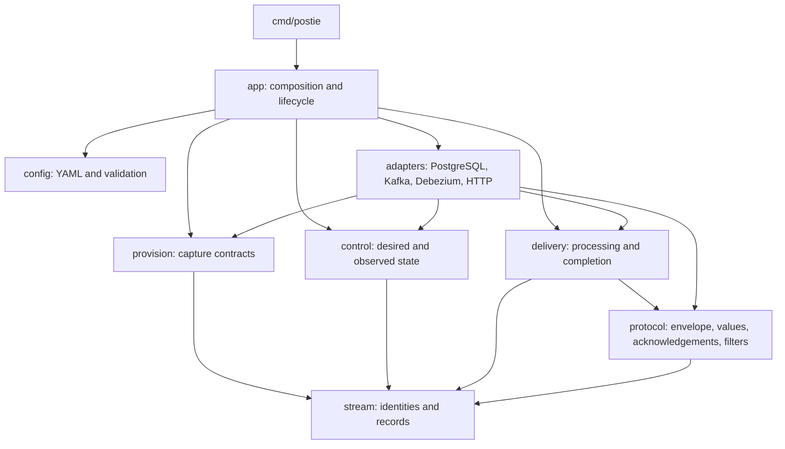

# Postie specification

Postie captures committed events from append-only PostgreSQL tables through
Debezium and Kafka, then delivers them to HTTP endpoints. Kafka retains source
records and delivery offsets. Control PostgreSQL stores stream registrations,
subscription state, worker leases, and terminal delivery skips. Recent activity
is held in a bounded process-local buffer and also written to standard output.
Applications own their event schemas, projections, and external side effects.

Postie currently supports PostgreSQL sources and `http-push` destinations.
Replay jobs, public publishing, other source databases, and exactly-once HTTP
effects are not supported.

## Capture contract

Each source names one table in the `public` schema. The configured `columns`
must include `serialColumn` and `partitioningColumn`. The serial column must be
a non-null `int2`, `int4`, or `int8` column with a unique or primary-key index
on that column alone. The partitioning column must be non-null and becomes the
Kafka message key. If `event_id` is included in the configured columns,
Postie uses it as the event identifier for delivery diagnostics and
idempotency.

Supported source column types are `int2`, `int4`, `int8`, `float4`, `float8`,
`bool`, `json`, `bytea`, `timestamp`, `timestamptz`, and `text`. Nullable SQL
`json` values, including SQL `NULL`, are supported. `jsonb` and other
PostgreSQL types are unsupported and fail source contract validation.

Provisioning takes an ascending snapshot and then follows WAL changes. Updates,
deletes, truncations, unsupported schema changes, a missing replication slot,
or unavailable history block the affected source or stream. Postie does not
silently skip these conditions or resnapshot an established generation.

The capture user needs logical replication access and permission to read the
table. By default, Debezium manages a filtered publication, which requires the
capture user to own the table. For a non-owner capture user, the table owner
must create a publication and `sources.<source-id>.publication` in
`examples/postie.yaml` must name it. Naming it there selects the externally
managed publication mode.

A stream generation freezes its table identity, configured columns, key,
partition count, and capture resource names. Changing the frozen identity
requires a new generation. Topics use delete-only retention, so event history
stays available for normal delivery. Topic compaction is not used.

## Configuration

The engine settings live in `examples/postie.yaml`. Source and destination
definitions live in `examples/application.yaml` using the existing YAML keys
`data_sources` and `data_destinations`.

PostgreSQL sources use `host`, `port`, `username`, `password`, `database`,
`table`, `columns`, `serialColumn`, and `partitioningColumn`. HTTP destinations
use `endpoint`, `username`, `password`, `sources`, and an optional `filter`.
Configuration supports the `postgres` source type and `http-push` destination
type. Validation rejects duplicate IDs, unknown source references, incomplete
settings, empty filters, missing configured columns, and unsupported types.

`${NAME}` environment substitution applies to YAML string and duration values.
Missing variables fail loading. Numeric fields require literal numeric values.

The operator API uses a separate bearer token. Set `POSTIE_OPERATOR_TOKEN` or
configure `operator.token_file`. The Compose environment also uses
`POSTIE_DATABASE_URL`, `POSTIE_CAPTURE_PASSWORD`, and
`POSTIE_DELIVERY_PASSWORD` for local values.

## HTTP delivery

This section defines the HTTP request Postie sends to configured `http-push`
destinations and the acknowledgement it accepts.

### Request body

Postie sends a JSON `POST` with `Content-Type: application/json` and HTTP
Basic authentication from the destination's configured `username` and
`password`. The body has these established keys:

```json
{
  "data_source_id": "application_events",
  "data_source_description": "Application event store",
  "data_destination_id": "Accounts_Projection",
  "data_destination_description": "Accounts read model",
  "payload": {
    "event_id": "evt_42",
    "recorded_on": "2024-03-01 08:00:00.123456+00",
    "payload": "{\"type\":\"AccountCreated\"}"
  }
}
```

`payload` contains the configured source columns as JSON fields. In the example,
the inner `payload` field is a string that holds JSON text. A PostgreSQL `text`
value stays a JSON string; Postie does not parse it as an object. JSON object
key order is not part of the contract.

Postie adds these diagnostic headers:

| Header                         | Value                                                                                                                             |
| ------------------------------ | --------------------------------------------------------------------------------------------------------------------------------- |
| `X-Postie-Event-ID`            | Source `event_id`, or a stable SHA-256 identifier derived from Kafka topic, partition, and offset when no event ID is configured. |
| `X-Postie-Delivery-Generation` | Stream generation number.                                                                                                         |
| `X-Postie-Replay`              | Boolean replay marker; current delivery is live, and replay jobs are not implemented.                                             |
| `X-Postie-Topic`               | Kafka topic.                                                                                                                      |
| `X-Postie-Partition`           | Kafka partition number.                                                                                                           |
| `X-Postie-Offset`              | Kafka offset.                                                                                                                     |
| `Idempotency-Key`              | Event identifier, destination ID, and generation joined with colons.                                                              |

The request timeout defaults to 60 seconds. Postie does not follow redirects.
Any non-2xx status is retryable. A response body larger than 64 KiB is rejected
and retried. A body of exactly 64 KiB still goes through acknowledgement
decoding.

### Acknowledgements

A destination acknowledges delivery with a non-null object at
`result.success`. The empty object is valid:

```json
{ "result": { "success": {} } }
```

A response can instead return an error object with `policy`, `class`, and
`description` fields:

```json
{
  "result": {
    "error": {
      "policy": "must_retry",
      "class": "temporary",
      "description": "try again"
    }
  }
}
```

`must_retry` retries the current record. `keep_going` records a terminal skip,
then advances the Kafka offset; it needs both `class` and `description`.
Unknown policies and malformed error objects retry. If both a valid `success`
and an error are present, success takes precedence.

Empty or malformed bodies, unknown result shapes, non-2xx responses, timeouts,
and connection failures all retry. Retries use jittered exponential backoff from
1 to 60 seconds and continue until delivery is cancelled. A `keep_going` skip is
saved before its offset is committed.

### Filters

An optional destination filter names a payload column and a list of allowed
string values. A string equal to one of those values is delivered. A different
string is skipped. If the field is missing, is not a string, or the payload is
not a JSON object, the record passes through without filtering.

### PostgreSQL value conversion

The source types listed in [Capture contract](#capture-contract) convert to
these JSON values in `payload`:

| PostgreSQL type        | JSON value sent in `payload`                                                                                                          |
| ---------------------- | ------------------------------------------------------------------------------------------------------------------------------------- |
| `int2`, `int4`, `int8` | JSON number. Integer range is validated and full integer precision is retained.                                                       |
| `float4`, `float8`     | JSON number. Input is range-checked and exponent notation is expanded to decimal form.                                                |
| `bool`                 | JSON `true` or `false`.                                                                                                               |
| SQL `NULL`             | JSON `null`, including nullable `json` columns.                                                                                       |
| `text`                 | JSON string, preserving the text value.                                                                                               |
| `json`                 | A JSON string containing the SQL JSON text; SQL `NULL` becomes JSON `null`.                                                           |
| `bytea`                | Base64 JSON string.                                                                                                                   |
| `timestamp`            | SQL-style string with a space separator and no zone; fractional seconds are emitted only when non-zero, with trailing zeroes trimmed. |
| `timestamptz`          | SQL-style string normalized to UTC, ending in `+00`; fractional seconds follow the same trimming rule.                                |

`jsonb` is unsupported. Unsupported source types fail source contract
validation instead of producing a guessed conversion.

## Delivery and operations

Each destination and generation has a Kafka consumer group. A worker processes
one request at a time per assigned partition. It commits an offset after a
terminal acknowledgement or audited `keep_going` skip. Other partitions and
destinations can continue while one partition retries.

Delivery is at least once. A receiver can commit its own change before Postie
commits the Kafka offset, so the same request can arrive again. Receivers should
atomically apply the event and record the idempotency key. Failures retry with
jittered exponential backoff between one and 60 seconds. There is no automatic
dead-letter skip.

The control lease lasts 30 seconds and is renewed every five seconds. Losing
control state stops new dispatch. During partition revocation, workers stop
scheduling requests, cancel in-flight work, and commit only completed records
while they still own the partition. A lost owner never commits.

The private operator API provides liveness, readiness, status, subscriptions,
pause/resume, and recent activity. Readiness stays at HTTP 503 until capture has
been provisioned and Kafka, control state, and workers are available. Every
route except liveness and readiness requires the operator bearer token; a
request without it returns 401. `postie config validate` validates configuration
and `postie provision` provisions capture. `postie` without a subcommand runs
delivery workers and the operator API. Administrative repair of blocked
generations is not implemented.

## Architecture

The `postie` binary, built from `cmd/postie`, serves delivery and also runs the
`config validate` and `provision` subcommands. All of them share the
composition layer. All application packages are internal to the module
`github.com/rafaeelricco/postie`.



### Package boundaries

| Package              | Responsibility                                                                                            |
| -------------------- | --------------------------------------------------------------------------------------------------------- |
| `internal/app`       | Builds adapters, maps configuration, starts workers and the operator API, and closes resources.           |
| `internal/config`    | Loads and validates YAML, applies defaults and environment substitution, and resolves the operator token. |
| `internal/stream`    | Defines sources, generations, immutable stream identities, capture names, and decoded records.            |
| `internal/provision` | Validates source table contracts and provisions topics, connectors, slots, and publications.              |
| `internal/control`   | Tracks desired subscriptions, worker observations, leases, readiness, and blocked streams.                |
| `internal/delivery`  | Applies filters, retries, acknowledgements, durable skips, and ordered commits.                           |
| `internal/protocol`  | Formats the HTTP envelope and converts PostgreSQL values; decodes acknowledgements and filters.           |
| `internal/adapters`  | Implements PostgreSQL, Kafka, Debezium Connect, HTTP delivery, and the operator API.                      |
| `internal/activity`  | Provides bounded structured activity and cursor-based reads.                                              |

Core packages depend on interfaces rather than database, broker, or HTTP
clients. `make test` runs the architecture check that guards those dependency
boundaries.

### Runtime ownership

1. `app.Bootstrap` constructs Kafka administration, control storage, PostgreSQL
   catalog clients, and the Kafka Connect client. The `postie provision`
   command validates a stream and records its identity; it does not start
   delivery workers.
2. `app.New` builds the control service and consumer factory. The control
   service renews a 30-second worker lease every five seconds, checks capture
   and dependencies, and reconciles desired destination state.
3. The Kafka adapter owns group membership, partition assignment, bounded
   batches, fetch backpressure, retained-history checks, and ownership-guarded
   commits. It preserves the source topic, partition, offset, and leader epoch
   when creating a stream record.
4. A delivery worker processes each partition sequentially. It decodes the
   record, checks for an existing durable skip, and formats the request. It
   then retries until a terminal outcome, persists a terminal skip when needed,
   and commits the offset. A crash after acknowledgement and before commit can
   redeliver the event, so receivers must deduplicate.
5. HTTP requests are fenced by the current dispatch lease. Revocation cancels
   in-flight requests and prevents late commits. One blocked partition does not
   stop delivery on other partitions.
6. Pause and resume persist desired state and wait for live workers to observe
   the revision. A loss of readiness stops dispatch. Shutdown stops workers
   before releasing the lease and closing adapters.

### Persistence and resource names

The control database creates its state tables with idempotent DDL when opened.
The tables use the `postie_` prefix. Kafka remains authoritative for delivery
offsets. Control PostgreSQL stores stream identities, topic identifiers,
subscription revisions, worker observations, leases, and terminal skips.

Capture topic, connector, slot, and publication names use the `postie_`
prefix and include the generation plus a hash of the namespace, environment,
source ID, and generation. The hash keeps distinct stream identities from
colliding. Connector configuration uses the configured partitioning column
as the Kafka message key and takes an ascending snapshot before following WAL.

### Tests and repository paths

Each package's tests sit beside it in `<pkg>_test.go`, and `cmd/postie` has its
own test. `tests/architecture` checks dependency rules and the allowed direct
modules. Integration tests in `tests/integration` use real PostgreSQL, Kafka,
and Debezium through the root `docker-compose.yml`; see
[Development topology](#development-topology).

## Planned replay (not implemented)

Replay is a planned capability and cannot be created or run in the current
release. The requirements below describe intended behavior, not an available
operator API or runtime guarantee.

Only projection destinations with a configured replay target are eligible for
replay. A replay uses an independent Kafka consumer group and cannot change
normal delivery offsets. Creation validates the stream identity and retained
history, then records starting offsets and exclusive per-partition boundaries.
It also stores the configuration revision and a declaration that the target
starts fresh. Dispatch begins after that.

A bounded replay stops at its recorded boundaries. A follow replay continues
after reaching those initial boundaries. Planned lifecycle states are `created`,
`running`, `following`, `paused`, `blocked`, `completed`, and `cancelled`.
Restart resumes from replay-group Kafka commits; missing history blocks the
replay, and a cancelled replay cannot resume.

Replay targets must use a fresh projection and deduplication database, or a
separate application generation namespace. The application validates the
rebuilt model and switches read traffic. Postie will not provide an atomic
multi-partition cutover while writes continue.

## Development topology

The development Compose project is named `postie`; its API and workers run
under the `postie` profile. Kafka Connect uses the `postie-connect` group
and topic names. Control-state tables and capture resources both use the
`postie_` prefix.

The integration tests reuse the root `docker-compose.yml` as the isolated
Compose project `postie-integration`, so its volumes stay separate from the
development stack. They start only the source database, control database,
Kafka, and Kafka Connect; the profile-gated `postie` service is never built.
`POSTIE_SOURCE_PORT`, `POSTIE_CONTROL_PORT`, `POSTIE_KAFKA_PORT`, and
`POSTIE_CONNECT_PORT` move the published ports off the development defaults of
15432, 15433, 29092, and 18083. The integration tests set them to 25432, 25433,
39092, and 28083. The advertised Kafka host listener follows
`POSTIE_KAFKA_PORT`. Set `POSTIE_KEEP=1` to retain the integration containers
and volumes after a run.
